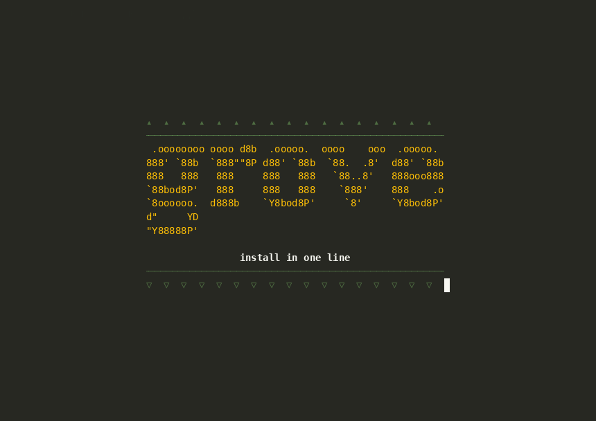
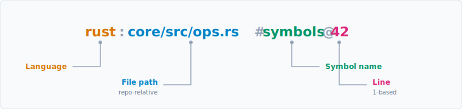
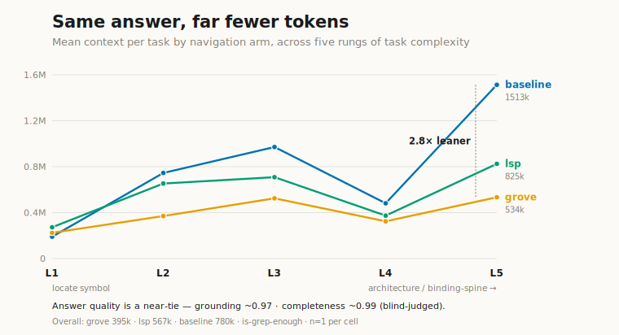
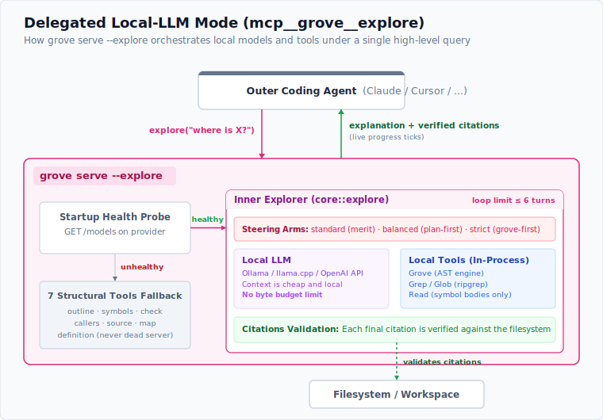

<div align="center">

# grove

### structural sight for coding agents

One tree-sitter engine&nbsp;·&nbsp;seven tools&nbsp;·&nbsp;a CLI **and** an MCP server&nbsp;·&nbsp;27 languages at runtime

[](https://github.com/Entelligentsia/grove/releases)
[](https://crates.io/crates/grove-cst)
[](https://github.com/Entelligentsia/grove/actions)
[](LICENSE)

[Quick start](#60-second-start)&nbsp;·&nbsp;[How it works](#how-it-works)&nbsp;·&nbsp;[Proof](#proof)&nbsp;·&nbsp;[Tools](#the-seven-tools)&nbsp;·&nbsp;[Languages](#languages)&nbsp;·&nbsp;[Docs](#documentation)

<br>



<sub>asciinema cast: [`docs/assets/grove_demo.cast`](docs/assets/grove_demo.cast) — replay with `asciinema play docs/assets/grove_demo.cast`</sub>

</div>

Coding agents burn tokens and round-trips `grep`-ing and reading whole files to
answer *where is this defined, what does it do, who calls it.* grove answers each
with **one symbol, by exact bytes** — behind a stable id the agent reuses across
turns. It's not an LSP; it's the cheap syntactic layer *beneath* one.

## 60-second start

### 1&nbsp;·&nbsp;Install

```bash
curl -fsSL https://raw.githubusercontent.com/Entelligentsia/grove/main/install.sh | sh
```

One line — detects your platform, verifies the sha256. Prefer Homebrew, npm,
cargo, or building from source? → **[Install](docs/install.md)**.

### 2&nbsp;·&nbsp;Wire it into your project

```bash
cd your-project
grove init
```

`grove init` detects your languages, fetches their grammars, pins `grove.lock`,
and registers grove with **every coding agent it finds** — Claude Code, Cursor,
Codex, Gemini CLI, Windsurf, VS Code — each at its own config path, plus a
steering note so the agent reaches for grove instead of grep. Scope it with
`--agents claude-code,cursor,…` (or `all`). → **[Setup](docs/setup.md)**.

### 3&nbsp;·&nbsp;Ask your agent

Start a fresh session and ask a *where / what / who-calls* question —
*"where is `provision_project` defined, and who calls it?"* It routes through
grove, not grep. That's it: your agent now has structural sight.

> **Prefer a skill?** `npx skills add Entelligentsia/grove` installs grove as a
> cross-agent skill (Claude Code, Cursor, Codex, Cline, …) and self-installs the
> binary on first use if it's missing.

## How it works

Every grove result carries a **symbol-id** — a stable handle the agent passes
from one tool to the next:



`outline` a file to a skeleton of ids → `source` one id for its exact bytes →
`callers` that id for its call sites. **One symbol at a time, by bytes** — never a
whole-file read. The same Rust engine answers on **two faces** — a human CLI
(`grove <verb>`) and an MCP server (`grove serve`) — so you and your agent see
identically. Grammars load **at runtime from a hosted WASM registry**, so adding a
language is a registry entry, not a recompile.

- **Token-cheap** — `outline` a 1700-line file as a skeleton; `source` one
  symbol's body, not the file. `map` returns a directory's definitions +
  references in a single call.
- **Byte-precise & stable** — the `symbol-id` above is exact and durable; pass it
  forward across turns instead of re-searching.
- **One engine, two faces** — the same binary drives the CLI and the MCP server.
- **Runtime grammars** — all 27 official tree-sitter grammars resolve from the
  registry; new languages need no recompile and no toolchain on your machine.

> **Not an LSP.** grove is syntactic, not semantic: it speaks MCP (not LSP),
> parses (doesn't analyze), and locates (doesn't refactor) — no type inference,
> completion, rename, or type-resolved go-to-def. It's complementary to an LSP,
> sitting *beneath* where semantics begin. Full reasoning:
> **[Is grove an LSP?](docs/faq.md)** · Product vision: **[`VISION.md`](VISION.md)**.

## Proof

grove is measured in
**[is-grep-enough](https://github.com/Entelligentsia/is-grep-enough)** — a fair,
blind-judged comparison of three navigation regimes (text `baseline`, structural
`grove`, semantic `lsp`) given the **same agent the same prompt** across **50
tasks**: 10 large, popular, grammar-backed repos × 5 rungs of climbing complexity
(locate a symbol → trace flow → recover an architecture). One variable — the
navigation capability.

[](https://entelligentsia.github.io/is-grep-enough/)

**Same answers, roughly half the context.** grove ties on answer quality
(grounding ~0.97, completeness ~0.99) while running **~2× leaner on tokens** —
widening to **2.8× on the hardest architecture traces** — and reported honestly,
including where it doesn't win.

<details>
<summary>The full curve — three findings, and the methodology</summary>

<br>

- **Answer quality ties — and on the hardest traces grove is the more reliable
  one.** Grounding ~0.97 and completeness ~0.99 across all three arms; grep is
  enough to be *correct* most of the time. But where text search drifts on a
  dense trace — the C++ L5 architecture trace drops baseline grounding to
  **0.80** — grove holds **0.97**, because it cites the real syntax tree instead
  of guessing line numbers.
- **grove runs leaner on context, and the lead widens with complexity.** ~395K
  mean tokens vs 567K (lsp) and 780K (baseline) overall — roughly half the
  text-search context. By the hardest rung (architecture / binding-spine),
  baseline pushes ~1.5M tokens against grove's ~534K — **2.8× leaner** (on the
  TypeScript L5 trace, 2.43M → 570K, **4.3× leaner**) — while grove stays
  tightest on quality.
- **Reported honestly, including where grove doesn't win.** On trivial
  *locate-one-symbol* tasks (L1), grove's fixed structural-call overhead means
  it isn't the cheapest — plain text search is. grove pays off on the navigation
  that actually costs tokens: tracing flow, mapping a subsystem, recovering an
  architecture.

Token throughput isn't the billed bill — much of baseline's volume is cheap
cache reads — but it is what drives context-window pressure and latency. Full
methodology, per-repo data, blind judgements, and every raw transcript:
**[is-grep-enough](https://github.com/Entelligentsia/is-grep-enough)** ·
**[live dashboard](https://entelligentsia.github.io/is-grep-enough/)**.

</details>

## The seven tools

| | Command | What it returns |
|---|---|---|
| **outline** | `grove outline <file>` | a file's definition skeleton (kind · name · parent · signature · id) |
| **symbols** | `grove symbols <dir> --name <n>` | repo-wide symbol search — `--name` is **exact**, `--name-contains` for substring |
| **source** | `grove source <id>` | one symbol's full source — no whole-file read |
| **check** | `grove check <file>` | ERROR / MISSING nodes — post-edit syntax check (exit 1 if any) |
| **callers** | `grove callers <name> -d <dir>` | call sites of a symbol, each with its enclosing function |
| **map** | `grove map <dir>` | directory dependency graph: definitions + outgoing references, no bodies |
| **definition** | `grove definition <name>` / `--at <f:l:c>` | go-to-def, by name or from a usage position |

Add `--json` to any command for the agent-facing shape. Full reference +
examples: **[Tools](docs/tools.md)**.

## Languages

**27 out of the box** — one binary, grammars loaded at runtime from the
[hosted WASM registry](docs/languages.md):

<table>
<tr><td>&nbsp;<b>Bash</b></td><td>&nbsp;<b>C</b></td><td>&nbsp;<b>C++</b></td><td>&nbsp;<b>C#</b></td><td>&nbsp;<b>Go</b></td><td>&nbsp;<b>Java</b></td><td>&nbsp;<b>JavaScript</b></td><td>&nbsp;<b>Julia</b></td></tr>
<tr><td>&nbsp;<b>PHP</b></td><td>&nbsp;<b>Python</b></td><td>&nbsp;<b>Ruby</b></td><td>&nbsp;<b>Rust</b></td><td>&nbsp;<b>Scala</b></td><td>&nbsp;<b>TypeScript</b></td><td>&nbsp;<b>TSX</b></td><td><kbd>Agda</kbd><sup>2</sup></td></tr>
<tr><td>&nbsp;<b>CSS</b><sup>2</sup></td><td><kbd>Embedded&nbsp;Template</kbd><sup>2</sup></td><td>&nbsp;<b>Haskell</b><sup>2</sup></td><td>&nbsp;<b>HTML</b><sup>2</sup></td><td><kbd>JSDoc</kbd><sup>2</sup></td><td>&nbsp;<b>JSON</b><sup>2</sup></td><td>&nbsp;<b>OCaml</b><sup>2</sup></td><td>&nbsp;<b>OCaml&nbsp;Interface</b><sup>2</sup></td></tr>
<tr><td><kbd>CodeQL</kbd><sup>2</sup></td><td><kbd>Regex</kbd><sup>2</sup></td><td><kbd>Verilog</kbd><sup>2</sup></td><td></td><td></td><td></td><td></td><td></td></tr>
</table>

<sup>2</sup> minimal profile — core tools only (`callers`/`definition` degrade);
full profile = all tools. `<kbd>` = no official logo. Profiles are data, not
compiled in. See **[Languages & grammars](docs/languages.md)**.

## Advanced

<details>
<summary><b>Delegated local-LLM mode</b> — one <code>explore</code> tool backed by your own local model (opt-in)</summary>

<br>

> **Opt-in.** The default grove (the CLI and the standard 7-tool `grove serve`)
> is unaffected — this mode turns on only when you run `grove init --as mcp-llm`.
> It is configured in `.grove/config.json`; the config format and the `explore`
> tool contract are covered by semantic versioning as of 0.3.0.

**What it is**: `mcp__grove__explore` is a single MCP tool the outer coding agent
calls with **one narrow "where is X" question**. Grove's inner Rust explorer
agent drives a short, bounded tool-calling loop locally — against your configured
local / OpenAI-compatible LLM (Ollama, llama.cpp) — and returns a short
explanation plus **validated `file:line` citations**. It is a *locator* (it finds
WHERE relevant code lives), not a full-analysis oracle: ask a few targeted
questions and synthesize the results yourself. The outer agent never sees the
inner tool calls — and never spends its own context on them.



**Setup**:
```
grove init --as mcp-llm   # interactive setup TUI (requires TTY)
grove config              # revisit / change settings at any time
```

**Three steering modes** (trade-off in one line each):

| Mode | Trade-off |
|---|---|
| `standard` | inner model picks tools naturally — lowest overhead, works well with capable models |
| `balanced` | two-phase plan → execute — best grounding and lowest hallucination rate, highest wall-clock |
| `strict` | grove-first steering prompts — cost/quality sweet spot for smaller models |

Change the active mode at any time with `grove config`.

**Health semantics**:
- Startup: `grove serve --explore` probes the configured provider (`/models`).
  - **Healthy** → expose `mcp__grove__explore` only.
  - **Unhealthy at startup** → transparent fallback: the 7 structural tools
    (`outline`, `symbols`, `source`, `check`, `callers`, `map`, `definition`)
    are surfaced instead so the outer agent is never left tool-less.
- Mid-session loss → `mcp__grove__explore` returns a recoverable `isError`
  response with a restart hint; the outer agent can retry or degrade gracefully.

**Debugging — see the inner conversation.** Turn on **Tap** (a `tap` flag in
`.grove/explore.json`, toggled in `grove config` — or just run `grove tap`, which
flips it on for you). `grove serve --explore` then records each session to a
per-session JSONL trace under `.grove/traces/`: a header with the calling agent's
identity, model and mode, then a `call_start` / `turn` / `call_end` stream per
`explore` call with **token usage and wall time**.

Run **`grove tap`** to browse them in a full-screen TUI — drill session → call →
turn: the session list shows agent, model, call count, total tokens and a live
marker; opening a call shows its metrics and each turn's request/response. It
refreshes live, so you can watch a session as it runs. Retention keeps the last
`trace_retain` sessions (default 50). `grove tap --no-enable` opens the browser
without changing the config.

</details>

<details>
<summary><b>Use grove as a Rust library</b> — embed the engine directly, no CLI, no subprocess</summary>

<br>

The same engine ships as a standalone crate, **`grove-core`**, so you can embed
grove's structural queries directly in Rust. The `grove` binary is a thin
`clap` + MCP shell over it. The crate is **`clap`-free**; grammars still load at
runtime from the WASM registry, so nothing is compiled in.

On crates.io as **`grove-cst`** — CST for the *concrete syntax trees* tree-sitter
builds (`grove-core` is taken by an unrelated crate). Alias it so imports stay
`use grove_core::…`:

```toml
# Cargo.toml
[dependencies]
grove_core = { package = "grove-cst", version = "0.3" }
```

```rust
use std::path::Path;
use grove_core::{init, ops};

fn main() -> anyhow::Result<()> {
    let project = Path::new(".");

    // 1. Provision grammars for this project's languages — fetches any missing
    //    grammar into the OS cache and pins grove.lock. Run once.
    for action in init::provision_project(project, false)? {
        println!("provisioned: {action}");
    }

    // 2. Query — grammars resolve from the cache. Every definition under `src/`,
    //    gitignore-aware, as typed results.
    for s in ops::symbols(&project.join("src"), None, None, false, false)? {
        println!("{} {} — {}:{}", s.kind, s.name, s.file, s.line);
    }
    Ok(())
}
```

(Offline? Set `GROVE_REGISTRY=<dir>` to resolve grammars from a pinned registry
and skip the fetch — see [`core/README.md`](core/README.md).)

The consumer surface is the [`ops`](core/src/lib.rs) module — the same seven
tools (`outline`, `symbols`, `source`, `check`, `callers`, `map`, `definition`),
returning typed `Symbol` / `Defect` / `CallSite` / `FileMap` values (re-exported
at the crate root). `init::provision_project` is the grammar-provisioning entry
point behind `grove init`. Crate overview and full API surface:
[`core/README.md`](core/README.md) · [`core/src/lib.rs`](core/src/lib.rs).

</details>

## Documentation

| Guide | What's inside |
|---|---|
| **[Install](docs/install.md)** | curl · Homebrew · npm · cargo · from source · the agent skill |
| **[Setup](docs/setup.md)** | `grove init`, `--as mcp\|skill\|both\|mcp-llm`, `--agents`, what it writes, offline/dry-run |
| **[Languages & grammars](docs/languages.md)** | the WASM registry, `fetch`/`lock`, where grammars live, profiles |
| **[Tools](docs/tools.md)** | the seven tools, `--json`, `symbol-id`, examples |
| **[MCP server](docs/mcp.md)** | `grove serve`, `.mcp.json`, steering, error model |
| **[grove-core](core/README.md)** | embed the engine in Rust — no CLI, no subprocess |
| **[Roadmap & repo layout](docs/roadmap.md)** | what's not done yet, source map |
| **[FAQ](docs/faq.md)** | *Is grove an LSP?* and other positioning questions |

Also: [`VISION.md`](VISION.md) (product vision) · [`CHANGELOG.md`](CHANGELOG.md)
(releases) · eval
[`is-grep-enough`](https://github.com/Entelligentsia/is-grep-enough) +
[live dashboard](https://entelligentsia.github.io/is-grep-enough/) · registry
[`grove-registry`](https://github.com/Entelligentsia/grove-registry) · Homebrew
tap [`homebrew-grove`](https://github.com/Entelligentsia/homebrew-grove).

## Status

Pre-1.0. `callers`/`definition` are name-based (no receiver-type resolution); 12
languages ship a minimal profile (core tools only); no incremental reparse yet.
Details and the rest of the roadmap: **[Roadmap](docs/roadmap.md)**.
