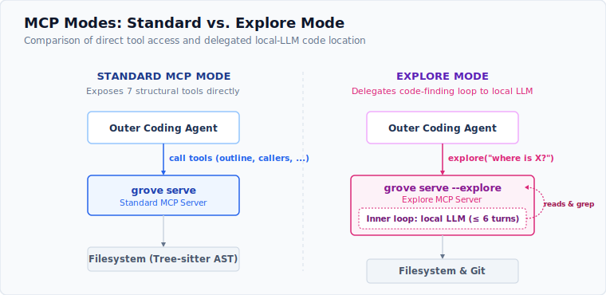

# Setup — `grove init`

One command makes a project one where the agent *uses* grove:

```bash
grove init           # in your project root
```

It detects the project's languages from the hosted catalog (so it sees a
language even before its grammar is installed), **auto-fetches** the grammars the
project needs, then writes three things (idempotently, preserving anything
already there):

- **`.mcp.json`** — registers the grove MCP server (*availability* — the tools exist).
- **`CLAUDE.md`** — a steering directive in a marked section (*adoption* — the agent
  reaches for grove instead of grep/whole-file reads; see [VISION §6.4.1](../VISION.md)).
- **`grove.lock`** — pins the detected grammars' version + wasm sha256.

`grove init --dry-run` detects without writing or fetching. Re-running only
updates grove's own pieces. Offline, it falls back to detecting from grammars
already in the cache.

## MCP, skill, or both — `grove init --as`

grove has one engine behind three faces: the CLI, the MCP server, and a
**cross-harness skill**. `--as` selects which integration `init` wires up
(grammar provisioning + `grove.lock` happens for every target):

```bash
grove init --as mcp      # default — .mcp.json + CLAUDE.md + grove.lock
grove init --as skill    # grammars + grove.lock only; install the skill separately
grove init --as both     # MCP wiring and grammars, for skill + MCP side by side
grove init --as mcp-llm  # explore-mode: .mcp.json (serve --explore) + CLAUDE.md + AGENTS.md
```

## Explore-mode — `grove init --as mcp-llm`

> **Opt-in.** The `.grove/config.json` config format and the `explore` tool
> contract are covered by semantic versioning as of 0.3.0. The standard
> `--as mcp|skill|both` targets and the 7-tool `grove serve` are unaffected.



`--as mcp-llm` wires grove in **explore-mode**: instead of exposing the 7
structural tools directly, the MCP server surfaces a single `explore` tool
backed by a local LLM (configured via `.grove/explore.json`). The outer agent
asks `mcp__grove__explore` narrow *where-is* questions; the inner explorer
locates the code with grove's tree-sitter + text tools and returns validated
`file:line` citations. If the provider is unhealthy at startup, grove falls back
to the standard 7 structural tools.

What it writes:

- **`.mcp.json`** — registers `grove serve --explore` (explore-mode MCP server).
- **`CLAUDE.md`** — steering block directing the agent to `mcp__grove__explore`;
  describes automatic fallback to the 7 structural tools when the provider is down.
- **`AGENTS.md`** — harness-neutral steering for non-Claude harnesses (Codex, Cline, etc.).

**First-run TUI**: on the first `grove init --as mcp-llm`, an interactive
terminal is required — the config TUI launches to collect the provider, base URL,
and model, saving them to `.grove/explore.json`. Re-runs (when `explore.json`
already exists) work without a TTY.

```bash
grove init --as mcp-llm --dry-run   # print planned writes without creating files
```

The skill is distributed through the [agent-skills tool](https://github.com/vercel-labs/skills):

```bash
npx skills add Entelligentsia/grove
```

The skill **prefers grove's MCP tools when the host exposes them and falls back
to the `grove` CLI otherwise** — so MCP and the skill are equal partners over the
same engine. On first CLI use it self-bootstraps: if `grove` isn't on `PATH` it
installs the npm package globally, then runs `grove init --as skill` to fetch the
repo's grammars.

## What `init` writes

| File | Purpose | Target |
|---|---|---|
| `.mcp.json` | registers `grove serve` for MCP-aware harnesses | availability |
| `CLAUDE.md` | a marked steering block routing the agent to grove | adoption |
| `grove.lock` | pinned grammars (version + wasm sha256) | reproducibility |

Re-running `grove init` updates only grove's own pieces and never clobbers
content outside its marked sections.

---

Next: [Languages & grammars](languages.md) · [MCP server](mcp.md)