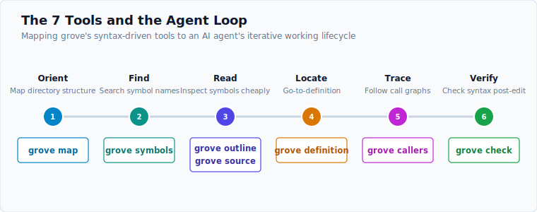

# Tools

grove's surface is the agent loop in miniature — seven tools, each returning one
symbol's worth of structure with a stable id. Add `--json` to any command for the
agent-facing structured shape.



| Phase | Command | What it does |
|---|---|---|
| Read | `grove outline <file> [--kind K] [--detail 0\|1\|2]` | compact definition skeleton: kind · name · parent · signature · id. Filter by kind / dial detail down for big files |
| Find | `grove symbols <dir> [--kind K] [--name SUB] [--name-contains] [--refs]` | repo-wide symbol search (gitignore-aware). `--name` is **exact** (case-insensitive); `--name-contains` (alias `--name-substr`) opts into substring |
| Read | `grove source <id>` or `grove source <file> <name>` | full source of one symbol — no whole-file read |
| Verify | `grove check <file>` | ERROR / MISSING nodes (exit 1 if any) — post-edit syntax check |
| Trace | `grove callers <name> [-d <dir>]` | call sites of a symbol, each with its enclosing function |
| Map | `grove map <dir> [--kind K] [--name SUB] [--name-contains]` | directory dependency graph: definitions + outgoing references, no source bodies |
| Trace | `grove definition <name> [-d <dir>]` or `grove definition --at <file:line:col>` | go-to-def, by name or from a usage position (`line`/`col` are 1-based). `--at` resolves in order: scope-aware local binding (shadowing a same-named global) → import edge to the target file (cross-file, for languages with an import-resolution strategy) → directory-wide name lookup |

## Conventions

- Lines and columns are **1-based** everywhere grove reports or accepts them
  (the editor / `grep -n` convention).
- Every result carries a stable **`symbol-id`** (`<lang>:<relpath>#<name>@<line>`,
  line 1-based) usable across turns — pass it from `outline`/`symbols`/`map` into
  `source`, `callers`, `definition`.
- `--name` matches **exactly** (case-insensitive) by default so `--name batch`
  returns `batch`, not `testCreateBatch`. Use `--name-contains` for fuzzy
  substring exploration. ([issue #37](https://github.com/Entelligentsia/grove/issues/37))

## Detail tiers (`outline`)

`--detail` controls field density so big files stay token-cheap:

- `0` — terse: kind · name · parent · line
- `1` — default: adds id · col · signature
- `2` — full: adds byte offsets (for `read` slicing between symbols)

## Examples

```bash
grove languages
grove outline foo.py --kind class        # python, loaded from wasm at runtime
grove outline src/engine.rs --kind function
grove source  src/mcp.rs serve
grove callers extract -d src
grove map     src --kind function         # dependency graph, no source bodies
grove check   src/registry.rs
grove symbols . --name batch              # exact: just `batch`
grove symbols . --name batch --name-contains   # substring: testCreateBatch, …
```

## Example results

Real output, run against grove's own Rust source. Add `--json` to any command
for the agent-facing structured shape.

**`outline`** — a file's definition skeleton (kind · name · parent · line:col · signature):

```console
$ grove outline core/src/render.rs
function   outline                                 13:8    pub fn outline(syms: &[Symbol]) -> String {
function   source                                  37:8    pub fn source(res: &SourceResult) -> String {
function   map                                     72:8    pub fn map(maps: &[FileMap]) -> String {
module     tests                                   95:5    mod tests {
method     sym                        tests        99:8    fn sym(kind: &str, …) -> Symbol {
```

**`symbols`** — find a name across a directory; each hit carries a stable id:

```console
$ grove symbols core/src --name outline
def function   outline                      rust:core/src/ops.rs#outline@100
def function   outline                      rust:core/src/render.rs#outline@13
```

**`source`** — one symbol's full body, by id (or `source <file> <name>`):

```console
$ grove source rust:core/src/render.rs#source@37
pub fn source(res: &SourceResult) -> String {
    format!("{}\n", res.source)
}
```

**`callers`** — every reference to a name, with its enclosing function and
provenance (`S` = structural / tree-sitter, `T` = textual / grep):

```console
$ grove callers outline -d core/src
core/src/ops.rs:909:20   tests::project_tiers_control_field_density   [S] let syms = outline(&file, None).unwrap();
core/src/ops.rs:939:19   tests::outline_filters_by_kind_and_skips_references  [S] let all = outline(&file, None).unwrap();
core/src/lib.rs:14:14    <top-level>                                  [T] //! - [`ops::outline`] — the definitions in one file …
```

**`map`** — a directory's definitions, each with its outgoing references after `→`
(no source bodies — one call replaces many `symbols`+`source` round-trips):

```console
$ grove map core/src
core/src/config.rs
  method     from_name              Mode          55   pub fn from_name(s: &str) …          → Ok, bail
  method     try_from               GroveConfig   111  fn try_from(raw: RawGroveConfig) …  → Ok, bail
  function   migrate_from_legacy_explore          157  fn migrate_from_legacy_explore() …  → Ok, Some, save, validate
```

**`definition`** — go-to-def by name (results can span files, so each leads with
`file:line:col`); `--at file:line:col` resolves from a specific usage site:

```console
$ grove definition symbols -d core/src
function   symbols                    core/src/ops.rs:153:8        pub fn symbols(
function   symbols                    core/src/render.rs:26:8      pub fn symbols(syms: &[Symbol]) -> String {
```

**`check`** — ERROR / MISSING nodes after an edit (exit 1 if any; here, clean):

```console
$ grove check core/src/render.rs
ok · no syntax errors · core/src/render.rs
```

## When to use which

- **One file** → `outline` (skeleton) → `source <id>` (the one symbol's body).
- **Where is X defined across the repo** → `symbols <dir> --name X` → `source <id>`.
- **Who calls X** → `callers <name> -d <dir>`.
- **How does this directory connect** → `map <dir>` (definitions + outgoing
  references, one call, no bodies) — replaces many `symbols`+`source` round-trips.
- **After an edit** → `check <file>` to confirm you didn't break syntax.

The cross-harness [skill](../skills/grove/SKILL.md) encodes these chains as the
agent's default procedure.

---

Next: [MCP server](mcp.md) · [Skill →](../skills/grove/SKILL.md)