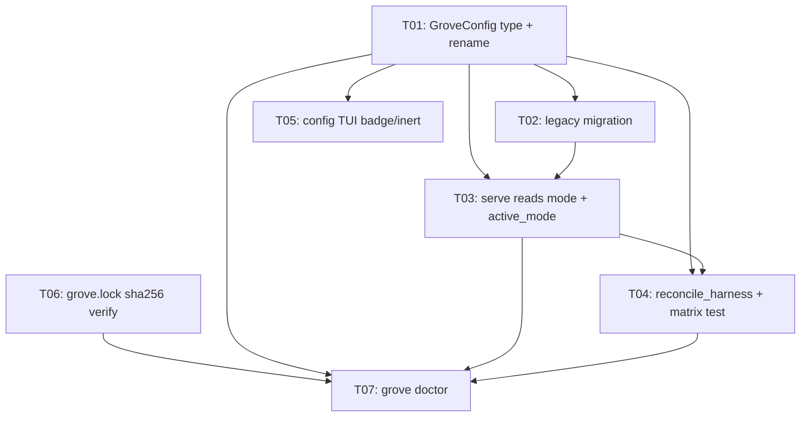

# Sprint Plan — GROVE-S03: `.grove/config.json` declared mode + `grove doctor`

**Sprint:** GROVE-S03
**Execution Mode:** sequential (wave-structured; see dependency graph)
**Requirements:** [`SPRINT_REQUIREMENTS.md`](./SPRINT_REQUIREMENTS.md)
**Inputs:** ADR 0002 (`docs/adr/0002-…`), doctor proposal (`docs/doctor-command-proposal.md`)

---

## Goals

1. A project's grove integration mode is a **single declared fact** in
   `.grove/config.json`, read identically by `serve`, agent steering, and `init`.
2. `grove init --as <mode>` **converges every harness file** to the new mode from
   one `reconcile_harness` code path, stripping the prior mode's residue.
3. `grove doctor` gives a **read-only pre-flight health check** catching
   declared-mode-vs-harness drift and provider-down conditions, gating CI via
   its exit code.

## Decomposition strategy

Two waves. **Wave A (T01–T05)** lands ADR 0002 — the config consolidation that
fixes the two structural bugs (sticky explore surface, orphaned `AGENTS.md`).
**Wave B (T06–T07)** lands `grove doctor`, which depends on the declared mode
(`active_mode`), the reconciled harness (its headline drift check targets
`reconcile_harness`'s output), and a new lock-verify primitive. Wave B is
sequenced strictly after the config foundation, per intake decision D1.

The `explore.mode → steering` rename (D2) folds into T01 (it is a field on the
same struct); the one-time legacy `explore.json` migration (D4, deprecated
immediately) is T02.

Altitude is fixed by the workspace split: all engine logic (`GroveConfig`,
migration, lock verify, `core::doctor`) lands in `core/`; `cli/` changes are the
thin `mcp.rs` surface trigger, `init.rs` reconciliation, the `config_tui/`
badge, and the `doctor` verb dispatch/format. `core` must not depend on the
CLI-side `Surface` type.

## Tasks

| Task ID | Title | Estimate | Depends On | Pipeline | Status |
|---|---|---|---|---|---|
| GROVE-S03-T01 | `GroveConfig` core type + explore section demotion + `mode→steering` rename | M | — | default | draft |
| GROVE-S03-T02 | Legacy `.grove/explore.json` migration on load (deprecated immediately) | M | T01 | default | draft |
| GROVE-S03-T03 | `serve` reads declared mode + shared `active_mode` resolver | M | T01, T02 | default | draft |
| GROVE-S03-T04 | `reconcile_harness` — single harness writer + transition-matrix test | L | T01, T03 | default | draft |
| GROVE-S03-T05 | `config` TUI mode badge + inert explore-section rendering | S | T01 | default | draft |
| GROVE-S03-T06 | `grove.lock` wasm sha256 verify primitive (core) | S | — | default | draft |
| GROVE-S03-T07 | `grove doctor` — `core::doctor` report + CLI verb (all checks, `--json`, exit code) | L | T01, T03, T04, T06 | default | draft |

## Dependency Graph

**Critical path:** T01 → T02 → T03 → T04 → T07 (config foundation → doctor
capstone). T05 (TUI) and T06 (lock verify) are off the critical path — T05
hangs off T01, T06 is independent and only gates T07.

## Per-task scope

- **T01** — Introduce `GroveConfig { version, mode, explore? }` in `core/`
  (new module, e.g. `core/src/config.rs`), reusing `ExploreConfig`'s raw-shape /
  fail-fast / atomic-save pattern. Add a `Mode` enum for the integration mode
  (`mcp|skill|both|mcp-llm|grammars`) — distinct from the existing steering
  `Mode`, which is **renamed** to `Steering` (its JSON key `mode → steering`).
  `GroveConfig::config_path` = `.grove/config.json`. No migration yet (T02), no
  consumer rewiring yet (T03).
- **T02** — `GroveConfig::load`: when `config.json` is absent but legacy
  `.grove/explore.json` exists, load it, synthesize `mode: mcp-llm`, map
  `explore.mode → explore.steering`, rewrite forward to `config.json`, and emit
  a deprecation warning (legacy path slated for removal). Migration test.
- **T03** — `determine_surface` (`cli/src/mcp.rs`) trigger changes from
  `ExploreConfig::config_path(root).exists()` to `config.mode == mcp-llm`, via a
  shared `active_mode(root, force) -> Mode` resolver both `serve` and (later)
  `doctor` call. Preserve `--explore`/`--standard` precedence and the S02
  health-gated fallback. This closes **bug 1**.
- **T04** — Extract `reconcile_harness(root, old_mode, new_mode) -> Vec<String>`
  in `init.rs`: write/rewrite/**strip** `.mcp.json`, `CLAUDE.md`, `AGENTS.md` to
  match `new_mode`, cleaning `old_mode` residue (removes the `AGENTS.md` explore
  block and the `--explore` arg when leaving `mcp-llm` — closes **bug 2**).
  `init` reads prior `mode` from `config.json`, reconciles, persists new `mode`.
  Only sentinel-delimited grove blocks / grove's own `.mcp.json` entry are
  touched. Table-driven **transition-matrix test** over all `A→B` switches.
- **T05** — `config_tui/` shows the active `mode` as a badge; when
  `mode != mcp-llm` the explore fields render inert/greyed with a dormant note.
  The TUI never mutates `mode` (no mode selector).
- **T06** — New `core::registry` (or `core::lock`) function: recompute each
  cached wasm's sha256 and compare to `grove.lock`'s `wasm` field; typed
  per-language result. Unit-tested; only runs when a lockfile is present.
- **T07** — `core::doctor` module: `Status`, `Check`, `Report`,
  `diagnose(root, force) -> Report` composing existing primitives
  (`registry::search_path`/`cache_root`, `GroveConfig::load`, `health_probe`,
  `list_models`, T06's lock verify) plus the **harness-consistency** check
  (declared `mode` vs `.mcp.json` args + steering blocks + the surface `serve`
  would boot — the state T04 produces). `cli/src/main.rs` gains a `Doctor` arm:
  human table or `--json`, exit code from `Report::ok()`. Shares the
  harness-consistency fixtures with T04's transition matrix.

## Technical Debt

- Retires the emergent-mode inference (`explore.json.exists()` as a surface
  trigger) — the root cause of the sticky-mode bug class.
- Introduces a deprecation on the legacy `.grove/explore.json` read path; a
  concrete removal-version is a nice-to-have this sprint and otherwise future
  debt to close.

## Risks

Carried from requirements — the load-bearing ones for sequencing:

- **Migration correctness (T02)** is the highest-severity risk: a bug drops
  deployed `mcp-llm` projects to Standard on upgrade. Gated by its own test and
  sequenced immediately after the type lands.
- **`reconcile_harness` host-content safety (T04)** — must strip only
  sentinel-delimited grove blocks; covered by the transition matrix + a
  host-content-preserved assertion.
- **`active_mode` divergence (T03/T07)** — mitigated by making it the single
  shared resolver both `serve` and `doctor` call.

## Carry-Over from GROVE-S02

`ExploreConfig`, the explore surface, and the health-gated startup fallback are
built (S02). S03 consolidates `ExploreConfig` under `GroveConfig.explore`,
replaces the `explore.json.exists()` surface trigger with the declared `mode`,
and preserves the S02 fallback semantics. mcp-llm remains experimental.
